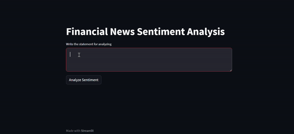

# Financial News Analysis LLM App

The Financial News Analysis LLM App is a Python application designed to analyze sentiment in financial news articles using powerful Language Model APIs. This application provides valuable insights into the sentiment expressed in financial news, aiding users in making informed decisions based on news sentiment.

## Overview

The Financial News Analysis LLM App allows users to input queries related to financial news and analyze sentiment using a state-of-the-art Large Language Model. The app leverages advanced natural language processing techniques to provide real-time sentiment analysis for financial articles.

## Demo
See how this tool works:



This LLM-powered application processes user-provided financial news queries and delivers sentiment analysis in real-time, enabling users to gauge the sentiment of news articles quickly.

## Features

- **Sentiment Analysis:** Provide sentiment analysis for financial news articles.
- **Real-time Insights:** Analyze news sentiment in real-time.
- **User-friendly Interface:** Simple and intuitive interface for easy interaction.

## How to Run

### Using Docker

1. Create a `.env` file in the root directory with the following configurations:
    ```bash
    OPENAI_API_TOKEN={OPENAI_API_KEY}
    EMBEDDER_LOCATOR=text-embedding-ada-002
    EMBEDDING_DIMENSION=1536
    MODEL_LOCATOR=gpt-3.5-turbo
    MAX_TOKENS=200
    TEMPERATURE=0.0
    FINANCIAL_NEWS_DATASET_LOCAL_PATH={REPLACE_WITH_FINANCIAL_NEWS_DATASET_RELATIVE_PATH}
    ```
 Replace the `OPENAI_API_TOKEN` configuration value with your key `{OPENAI_API_KEY}` and replace `FINANCIAL_NEWS_DATASET_LOCAL_PATH` with a path where Financial News Dataset folder is located `{REPLACE_WITH_FINANCIAL_NEWS_DATASET_RELATIVE_PATH}`

2. Run the Docker container:
    ```bash
    docker compose up
    ```

### Running from Source

1. Clone the repository:
    ```bash
    git clone https://github.com/Avinash238/Financial_News_Analysis.git
    cd Financial_News_Analysis
    ```

2. Set up environment variables in a `.env` file:
    ```bash
    OPENAI_API_TOKEN={OPENAI_API_KEY}
    HOST=0.0.0.0
    PORT=8080
    EMBEDDER_LOCATOR=text-embedding-ada-002
    EMBEDDING_DIMENSION=1536
    MODEL_LOCATOR=gpt-3.5-turbo
    MAX_TOKENS=200
    TEMPERATURE=0.0
    FINANCIAL_NEWS_DATASET_LOCAL_PATH="../../../mnt/c/Users/your-username/Documents/Financial_News_Dataset"
    ```
    Replace `FINANCIAL_NEWS_DATASET_LOCAL_PATH` with your local Financial News Dataset folder path and optionally, customize other values.

3. Install the required dependencies:
    ```bash
    pip install -r requirements.txt
    ```

4. You start the application by running `main.py`:
    ```bash
    python main.py
    ```

5. Run Streamlit UI
You can run the UI separately by running Streamlit app `streamlit run ui.py` command. It connects to the backend API automatically, and you will see the UI frontend is running on your browser.

## Usage

1. Access the app through your web browser at `localhost:8080`.
2. Enter queries related to financial news.
3. View the sentiment analysis for the provided financial news articles.

## Contributors

- [Avinash238](https://github.com/shaileshysk)

## License

This project is licensed under the [MIT License](LICENSE).
